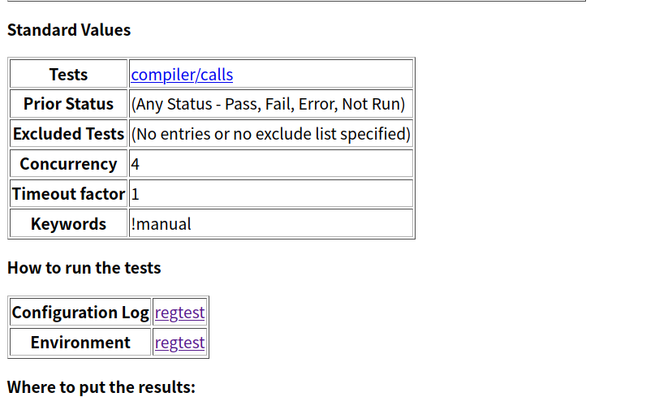
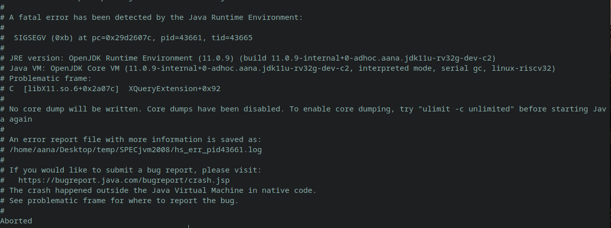

# 编译openjdk-rv32


环境为deepin20.6，编译的过程基本上参考了[1]，其中包含了从构建工具链到测试的步骤。

[TOC]


## 安装编译工具链和openjdk依赖库

按照[1]中的**[交叉编译RV32G的OpenJDK11(ZERO)](https://github.com/openjdk-riscv/jdk11u/wiki/Build-OpenJDK11(zero-VM)-for-RV32G)**、**[编译JDK所需额外库的安装脚本](https://github.com/openjdk-riscv/jdk11u/wiki/External-Libraries)**来进行就行了，只要不出现网络问题基本上应该是没有问题的，教程中也给出了网络出现问题时的解决方法。


## 编译openjdk-rv32

configure的参数和[1]中略有不同，因为需要构建c2，而[1]中给出的是构建zero的参数，我使用了下面的配置参数，细节可以参考`doc/building.html`：

```bash
bash configure \
--openjdk-target=riscv32-unknown-linux-gnu \
--disable-warnings-as-errors \
--with-sysroot=/path/to/riscv-sysroot \
--with-jtreg=/home/aana/Desktop/jdk/jtreg \
--x-includes=/path/to/riscv-sysroot/usr/include \
--x-libraries=/path/to/riscv-sysroot/usr/lib \
--with-boot-jdk=/home/aana/jdk/jdk-11 \
--with-debug-level=fastdebug \
--with-jvm-variants=custom \
--with-jvm-features="compiler2 minimal serialgc" \
--prefix=$PWD/fastdebug_client \
--with-extra-cflags="-w" \
--with-extra-cxxflags="-w"
```

因为给出的variants中并没有只包含c2不包含c1的配置，而目前还没有和c1有关的文件，所以会导致编译错误。使用`--with-jvm-variants=custom`加上`--with-jvm-features`指定需要的组件即可。不太清楚这个`minimal`是什么，不过加上好像没问题。

配置好之后正常的make就可以了。最终构建的产物并不需要进行install就可以进行测试了，install会占用很多的时间，主要就是将class文件打包为了jmod。

执行HelloWorld验证一下编译是否成功，在我所构建的commit`5683f49`，在使用`-Xint`的情况下可以执行，如果不使用这个flag则会触发如下的assertion：

```c++
assert((src_lo & 1) == 0 && src_lo + 1 == src_hi && (dst_lo & 1) == 0 && dst_lo + 1 == dst_hi)
```

如果是release版本则是其他的错误，这个问题在[issue#439](https://github.com/openjdk-riscv/jdk11u/issues/439)中也提到过，并且在[issue#441](https://github.com/openjdk-riscv/jdk11u/pull/441)中解决了，不过我并没有编译最新的版本。


## 测试

尝试进行一下测试，我目前尝试了两个测试集的部分测试，分别是**jtreg**和**SPECjvm2008**。由于需要使用qemu来执行构建生成的程序，所以说需要将原程序替换为一个执行qemu的脚本，在[2]中有这样的一个脚本：

```shell
#!/bin/sh

sysroot=/path/to/riscv32/sysroot
QEMU=/path/to/qemu/bin/qemu-riscv32
JAVA_HOME=/path/to/jdk

cd $JAVA_HOME/bin
for i in `ls|grep -v "\-bak$"`
do 
    if [ -f $i ]
    then
        if [ -f ${i}-bak ]
        then 
            continue
        fi
    echo $i
        mv $i ${i}-bak
        echo "#!/bin/sh" > ${i}
        echo "export JAVA_HOME=$JAVA_HOME" >> ${i}
        echo "$QEMU -L $sysroot \$JAVA_HOME/bin/${i}-bak \"\$@\"" >> ${i}
        chmod +x ${i}
    fi
done
```

最好能够对release的构建进行测试，如果对debug的构建进行测试，运行速度会非常慢。

另外，似乎只能对core进行测试，因为一旦在`with-jvm-features`中加入了`compiler2`就会出现错误，即使是加上了`-Xint`也一样（加和不加的错误不同）。

### jtreg

首先需要下载jtreg，它似乎没有提供官方的构建版本，我在openjdk的主页中没有找到，不过可以使用[这个](https://builds.shipilev.net/jtreg/)已经构建好了的。

在`doc/building.html`中有说道如何使用构建系统来进行测试（比如使用`make run-test-tier1`），但是通过make来运行jtreg似乎不行，会产生报错，所以只能够直接执行jtreg，关于jtreg的具体使用可以参考官方文档和《OpenJDK Cookbook》[3]的第9章，个人感觉书要好些。关于测试集包含了哪些测试，如何运行特定的测试集，这些内容在书和文档中已经给出了比较充足的描述。

下面是我所使用的测试脚本。

```shell
#!/bin/sh

export JT_JAVA=/path/tojdk # 并不是被测试的jdk，是用来执行运行框架的jdk。

/path/to/jtreg \
-jdk:/path/totested-jdk \ # 被测试的jdk，也就是构建出来的那个。
-agentvm \ # 重复使用jvm，可以加快测试速度。
-conc:4 \ # 并发度，可以加快测试速度。
-automatic \ # 只运行不需要人干预的自动测试。
-verbose:summary \ # 命令行输出的结果详细程度。
-w build/jtreg/work \ # 工作路径，指定测试集的class输出的位置。
-r build/jtreg/report \ # 结果输出路径。
/path/to/tested-jdk/test/hotspot/jtreg:hotspot_runtime # 指定测试group，':'之前是测试根路径，此路径包含了一个TEST.ROOT文件。也包含了TEST.groups，定义了可以使用的group。也可以使用路径或者文件，不指定group，但是需要在根下面的目录或者文件，jtreg会自动寻找根。
```

输出的报告可以在`-r`指定的路径中查看，我的一个测试结果截图如下：



其构建参数使用了：`--with-debug-level=release`、`--with-jvm-variants=core`。

### SPECjvm2008

使用SPECjvm2008的方式在[4]中很详细，不过我在使用的时候出现了报错，但是没有影响实际使用，似乎和X库有关，可能是在生成最终测试结果的时候调用了这个库，不知道是否和使用了`--with-jvm-variants=core`有关。




## IDE

如果使用CLion作为IDE的话，需要在编译的时候生成`compile_commands.json`文件，因为CLion对make项目的支持并不好，很容易出现大面积的不可识别。`compile_commands.json`文件中保存了编译实际使用的指令，能够帮助CLion提高可识别率。

为了生成这个文件需要使用一些生成工具，我使用了[bear](https://github.com/rizsotto/Bear)，使用的方式非常简单，只需要在原有的编译命令之前加上`bear`就行了，在编译结束之后就会在项目的根目录中出现`compile_commands.json`了，使用clion作为IDE，用clion将此文件作为项目打开。

由于项目本身比较大，所以对电脑性能要求会比较高，不过可以通过一些简单的配置尽可能地降低clion的性能要求。

1. 关闭无用插件，许多的插件都用不上，所以尽量关闭就行了，比如一些关于sql、qt、web开发的插件。
2. 将堆最大堆大小设置为6G以上，`help`->`Change Memory Settings`，同时在底部的工具栏打开Memory Indicator。
3. 关闭无用inspections，在打开文件的时候往往会对文件进行一些静态分析，对cpu占用很高。打开`Settings->Editor->Inspections`，关闭`Proofreading`、`C/C++->Data flow Analysis`的全部内容、`C/C++->Static Analysis Tools->Clang-tidy和Clazy`。

上面这些修改不会给代码提示带来影响，如果希望进一步降低性能消耗还可以关闭更多的inspections和vm进行更多的配置，我在进行了上述配置之后clion的内存消耗能够保持在3G以内。


## 参考

[1] [Home · openjdk-riscv/jdk11u Wiki · GitHub](https://github.com/openjdk-riscv/jdk11u/wiki)

[2] [Run or debug with QEMU user mode](https://github.com/openjdk-riscv/jdk11u/wiki/Run-or-debug-with-QEMU-user-mode)

[3] [OpenJDK Cookbook](https://www.packtpub.com/product/openjdk-cookbook/9781849698405)

[4] [SPECjvm2008 Benchmark](https://github.com/openjdk-riscv/jdk11u/wiki/SPECjvm2008-Benchmark)

